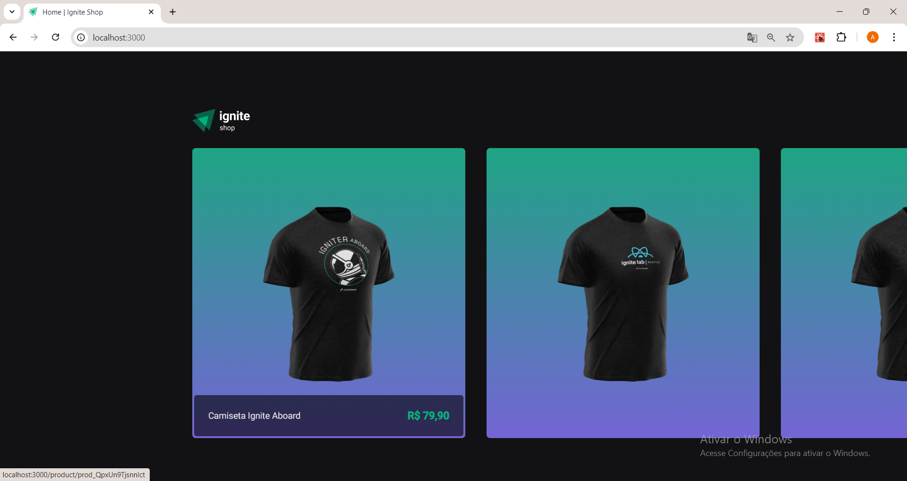
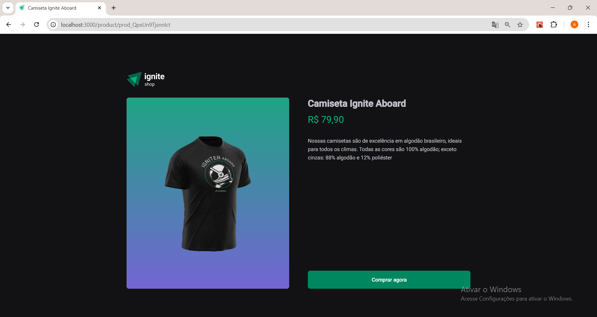
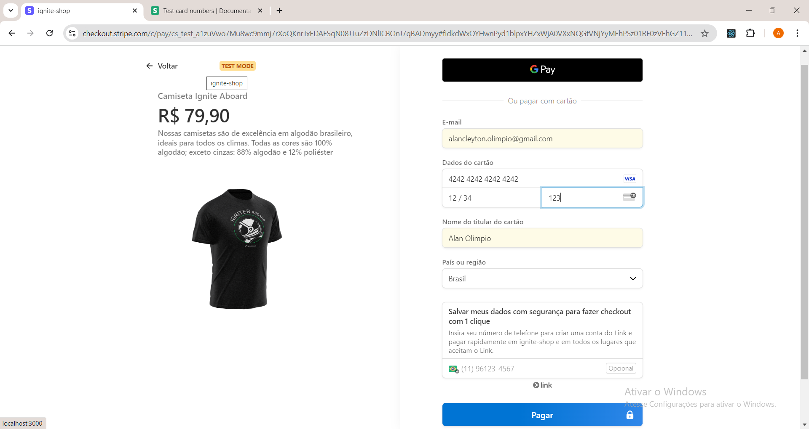
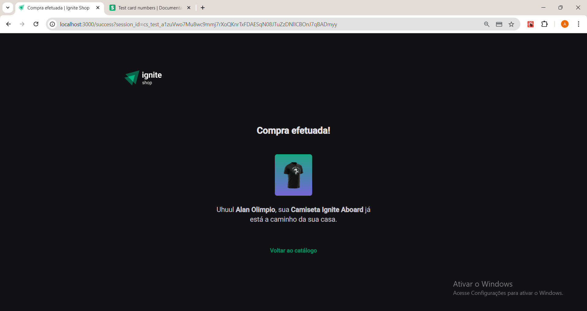

# Ignite Shop

Esse aplicativo foi desenvolvido no curso <a href="https://app.rocketseat.com.br/journey/react-js-2022/overview" target="_blank">ReactJS</a> , o objetivo era aprender fundamentos do Next.js.

|Home| Product| Checkout | Success |
|-------|------|------|------|
|||||

## 🔨 Funcionalidades do projeto

É um e-commerce conectado a uma API do <a href="https://stripe.com/br" target="_blank">Stripe</a>.

## ✔️ Técnicas e tecnologias utilizadas

Lista das bibliotecas utilizadas no desenvolvimento:

- `react`
- `react-dom`
- `@stitches/core`
- `@stitches/react`
- `typescript`
- `axios`
- `keen-slider`
- `next`
- `stripe`

## 🛠️ Abrir e rodar o projeto

Dentro da pasta do projeto execute npm i ou yarn para instalar as dependências, é necessário ter um conta criada no <a href="https://stripe.com/br" target="_blank">Stripe</a> com produtos cadastrados, obter as chaves da API renomear a  .env.example para .env.local, adicionar as chaves de api NEXT_PUBLIC_STRIPE_PUBLISHABLE_KEY e STRIPE_SECRET_KEY salvar o arquivo e para  rodar a aplicação é necessário abrir o terminal na pasta do projeto e digitar os comandos npm run dev  ou yarn dev.
